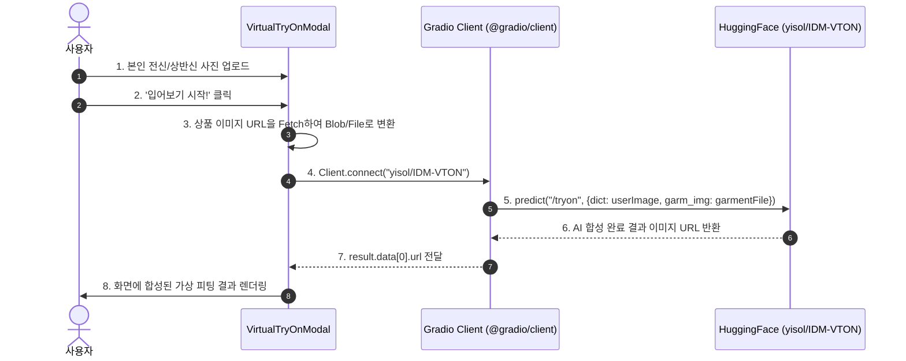

# ⚙️ 03. 상태 관리 & 비즈니스 로직 (Business Logic & State)

본 문서는 **LikeDzy** 애플리케이션의 핵심 데이터 흐름, 전역 상태(Context API), AI 가상 피팅 파이프라인, 포트원 결제 및 서버리스 백엔드 연동 로직을 설명합니다.

---

## 1. 전역 상태 관리 (Context API)

> `main.jsx`의 Provider 계층 순서: `LanguageProvider` > `AuthProvider` > `CartProvider` > `App`

### 1.1 LanguageContext (`src/i18n/LanguageContext.jsx`)
- **역할**: 다국어(i18n) 지원을 위한 언어 상태 및 번역 함수 제공.
- **제공 Provider 값**:
  - `language`: 현재 선택된 언어 코드 (기본값: `'ko'`).
  - `setLanguage(lang)`: 언어 전환 함수.
  - `t(key)`: dot-notation 키로 번역 문자열 조회 (`t('header.login')` → `'로그인'`).
- **번역 데이터**: `translations.js`에 `{ ko: {...}, en: {...} }` 형태로 정의.

### 1.2 AuthContext (`src/context/AuthContext.jsx`)
- **역할**: Firebase Authentication 서비스와 동기화된 사용자 인증 상태 제공.
- **제공 Provider 값**:
  - `currentUser`: 현재 로그인된 Firebase User 객체 (`null` 또는 유저 세션).
  - `signup(email, password)`: 이메일/비밀번호 신규 회원가입.
  - `login(email, password)`: 이메일/비밀번호 로그인.
  - `logout()`: 세션 로그아웃.
  - `loginWithGoogle()`: GoogleAuthProvider 팝업 소셜 로그인.
- **동작 방식**: `useEffect` 내 `onAuthStateChanged` 리스너를 통해 페이지 뒤로가기/새로고침 시에도 인증 유지.

### 1.3 CartContext (`src/context/CartContext.jsx`)
- **역할**: 장바구니 상태 관리 및 `localStorage` 자동 동기화.
- **제공 Provider 값**:
  - `cart`: `[{ product, option, quantity }]` 형태의 상품 배열.
  - `addToCart(product, option, quantity)`: 상품 및 선택한 옵션(사이즈/색상)을 장바구니에 추가 및 모달 열기.
  - `removeFromCart(productId, optionName)`: 특정 상품의 선택 옵션 제거.
  - `updateQuantity(productId, optionName, quantity)`: 수량 변경 (옵션 재고 제한 `option.stock` 자동 검증).
  - `clearCart()`: 장바구니 초기화.
  - `isCartOpen`, `setIsCartOpen`: 슬라이드 장바구니 모달 표시 제어.

---

## 2. AI 가상 피팅 파이프라인 (Virtual Try-On Flow)

AI 가상 피팅은 사용자가 올린 본인 착용 사진에 선택한 상품 옷을 자연스럽게 합성하는 기능입니다.



- **예외 처리**: 네트워크 지연 또는 AI 서버 혼잡 시 로딩 상태 마이크로 메시지 표시 및 에러 시 업로드 스텝 복구.

---

## 3. 결제 및 주문 처리 워크플로우 (Payment & Order Flow)

### 3.1 결제 프로세스
1. **장바구니 확인**: `CartModal.jsx`에서 주문 고객 정보(이름, 연락처, 주소) 입력.
2. **포트원(Portone/Iamport) SDK 연동**:
   - `window.IMP.request_pay` 호출하여 신용카드/간편결제 창 띄움.
3. **결제 결과 처리**:
   - 테스트/개발 환경: 성공 시 client-side Firestore `orders` 문서 작성 및 재고 업데이트.
   - 서버리스 검증 환경: Firebase Cloud Functions `verifyPayment` HTTP 엔드포인트 호출.

### 3.2 Cloud Functions 서버 검증 (`functions/index.js`)
```javascript
// verifyPayment 함수 주요 단계
1. 포트원 REST API 토큰 발급 (getToken)
2. 포트원 결제 내역 서버 조회 (payments/{imp_uid})
3. 요청 금액(expectedAmount)과 실 결제 금액 비교 검증 (위변조 차단)
4. Firestore `orders` 컬렉션에 서버 타임스탬프로 결제 정보 저장
5. `products` 컬렉션의 옵션별 재고(stock) 차감 및 판매량(sales), 입출고 이력(history) 원자적 업데이트
```

---

## 4. 방문자 통계 집계 (Visitor Analytics)

- **위치**: `src/pages/Storefront.jsx`
- **로직**:
  - 메인 페이지 진입 시 오늘 날짜(`YYYY-MM-DD`) 구함.
  - `sessionStorage.getItem('visited')` 확인 (중복 카운트 방지).
  - 미방문 시 Firestore `doc(db, 'visitorStats', today)` 문서에 `count: increment(1)` 실행.
  - `AdminStats.jsx`에서 최근 30일 데이터 차트 시각화.
